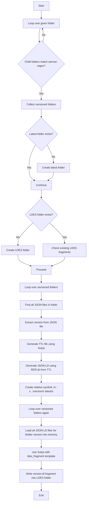

To build the docker image:

```bash
docker build -t ror-records-ldes-builder .
```


## Before running the container

- Place your input files in a folder named `your_input_folder` in the current directory.
- (Optional) Place your templates in a folder named `your_input_folder_with_templates` in the current directory.
   if you don't provide this folder, the container will use the default templates.
- $pwd is the current directory where you have the input folder.

To run:

```bash
docker run --rm -v "$(pwd)/your_input_folder:/workspace" -v "$(pwd)/your_input_folder_with_templates:/src/templates" ror-records-ldes-builder
```

for windows users
```bash
docker run --rm -v /$(pwd)/your_input_folder:/workspace -v /$(pwd)/your_input_folder_with_templates:/src/templates ror-records-ldes-builder
```

